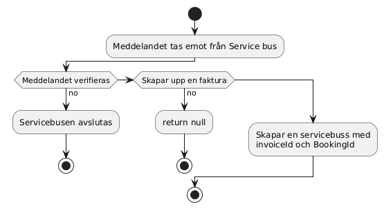

# Invoice Processing System

Detta projekt hanterar skapandet av fakturor baserat på bokningsmeddelanden mottagna från en Azure Service Bus. 
Systemet använder Entity Framework för datalagring och stödjer vidarekommunikation av faktura-ID samt e-postgenerering för färdiga fakturor.

---

## Funktionalitet

-  Tar emot `BookingTicketOrder` från Service Bus
-  Skapar faktura i databasen med hjälp av Entity Framework
-  Skickar `InvoiceId` och `BookingId` vidare till annan kö
-  Kan skapa och skicka e-post för fakturor (HTML + plaintext)
-  Hämtar alla fakturor från databasen och cachar dem.
-  Hämtar faktur ut ifrån id
-  API-nyckel krävs för att få åtkomst till Invoice-tjänsten

---

## Flöde

### Aktivitetsschema:

1. Mottag ett meddelande från Service Bus
2. Meddelandet verifieras `BookingTicketOrder`
3. Skapa ett `CreateInvoice`-objekt
4. Spara faktura i databasen
5. Skicka vidare `InvoiceId` + `BookingId` till annan Service Bus-kö

---

